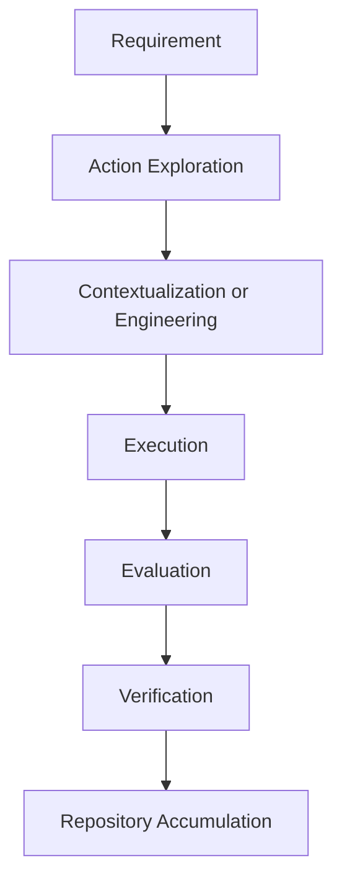

# Open Action Space (OAS)

**An open environment for exploring, adapting, composing, and engineering actions for human–AI task execution.**

**Open Action Space (OAS)** is a project for developing and exploring the **Action Space** concept within **ARISE: An Action-Centered Framework for Human–AI Task Execution**.

The Action Space is the environment in which actions can be explored, contextualized, adapted, integrated, composed, constructed, engineered, evaluated, and refined. It complements the **Action Repository**, which stores actions that have already been established and verified for reuse.

OAS is intended to support the development of actions beyond what is already available in an existing action inventory. It provides a space in which an existing action can be adapted to a particular context, multiple actions can be composed, or a new action can be constructed when no suitable action exists.

> **Action Repository = established operational knowledge**  
> **Action Space = exploration and engineering of operational possibilities**

## From Action Repository to Action Space

When a task or subtask is identified, an appropriate action should first be sought among established actions in an Action Repository.

There are three common situations:

1. **Direct reuse** — an existing action satisfies the requirements and can be used directly.
2. **Contextualization** — an existing action is relevant but needs adaptation to the specific context, inputs, constraints, or desired outcomes.
3. **Construction or engineering** — no suitable action exists, so a new action must be designed, constructed, composed, or engineered.

The Action Space provides the environment for the second and third cases.

A contextualized action does not necessarily become a new permanent action. If its underlying operational identity remains sufficiently stable, the contextualized realization can remain specific to the current task or context.

A newly engineered action may be promoted to an Action Repository when it has been sufficiently evaluated and verified for reuse.

The resulting cycle can be summarized as:

**requirement $\rightarrow$ action exploration $\rightarrow$ contextualization or engineering $\rightarrow$ execution $\rightarrow$ evaluation $\rightarrow$ verification $\rightarrow$ repository accumulation**

## What Is the Action Space?

The Action Space is not simply another collection of actions.

It is a broader operational environment in which actions can be:

- **explored** — identify potentially relevant actions or action combinations;
- **contextualized** — adapt an established action to a particular situation;
- **composed** — combine multiple actions into a larger execution;
- **integrated** — connect actions with other procedures, tools, or performers;
- **constructed** — create an action from operational requirements;
- **engineered** — refine, transform, specialize, generalize, or otherwise modify an action;
- **evaluated** — assess whether an action satisfies its intended requirements;
- **refined** — improve an action based on execution experience and evaluation results.

The Action Space therefore represents the **adaptive and generative side** of an action-centered task-execution system.

## Action-Centered Task Execution

OAS follows the action-centered perspective of ARISE.

A task represents a desired objective or outcome. A task may be accomplished through a single action or decomposed into subtasks, each requiring one action to implement.

The central operational relationship is therefore:

**task $\rightarrow$ subtask $\rightarrow$ action**

The Action Space operates at the action level. It provides a place to determine whether an established action is sufficient, whether it needs contextualization, whether multiple actions should be composed, or whether a new action needs to be engineered.

An action remains conceptually independent of its performer and implementation. The same action may be performed by an agentic AI, a human, or a human–AI collaborative configuration, using different tools, models, procedures, or implementations.

## Action Space and Action Repository

The two concepts are complementary:

| Action Space | Action Repository |
|---|---|
| Exploration and engineering | Established and verified actions |
| Adaptive | Relatively stable |
| Candidate and contextual actions | Reusable actions |
| Construction and refinement | Accumulation and reuse |
| Operational possibilities | Operational knowledge |

An action can move between the two as it is developed and evaluated:

**Action Repository $\rightarrow$ Action Space $\rightarrow$ evaluation $\rightarrow$ Action Repository**

This does not imply that every action-space activity must produce a new action. Many task-based action adaptations may remain contextual and task-specific, and are only valid for specific scenarios.

## Open Action Space

The term **Open Action Space** emphasizes that the space is intended to remain open to:

- new actions and action combinations;
- different human and AI performers;
- different tools, models, and implementations;
- new task requirements and contexts;
- alternative action-engineering approaches;
- community contributions and future extensions.

The objective is not to enumerate every possible action in advance. Instead, the Action Space should support the continual development of operational solutions as new requirements emerge.

## Relationship to ARISE

OAS is a concrete project for exploring and operationalizing the **Action Space** concept within:

**ARISE: An Action-Centered Framework for Human–AI Task Execution**

Within this framework:

- **Action** is the fundamental operational unit.
- **Action Space** is the environment for action exploration and engineering.
- **Action Repository** is the persistent collection of established actions.
- **Performer** may be a human, agentic AI, or human–AI configuration.
- **Implementation** may involve models, tools, algorithms, procedures, or combinations of these.

OAS focuses specifically on the Action Space side of this framework.

## Current Status

This repository is currently an **early-stage Action Space implementation and research project**.

No established action inventory is currently provided. The repository is intended to evolve as action-space concepts, representations, engineering procedures, evaluation methods, and supporting infrastructure are developed.

The current priority is therefore to establish a practical structure for action exploration and engineering rather than to populate the repository with a large collection of predefined actions.

## Intended Development

Future development may include:

- action exploration and discovery;
- action contextualization and adaptation;
- action composition;
- action construction and engineering;
- action evaluation and verification;
- representations of action dependencies and relationships;
- integration with Action Repositories such as the **Universal Action Repository (UAR)**;
- tooling for human–AI collaborative action engineering;
- mechanisms for transferring verified actions back into persistent repositories.

## Relationship to UAR

The **Universal Action Repository (UAR)** and **Open Action Space (OAS)** serve complementary roles.

**UAR** focuses on the accumulation and reuse of established actions.

**OAS** focuses on the exploration, adaptation, construction, and engineering of actions.

Together they represent two complementary parts of an evolving action-centered execution system:

**Action Repository $\leftrightarrow$ Action Space**

Established actions provide starting points for new task execution, while action-space activities can generate new operational knowledge that may eventually become reusable repository actions.

## Vision

Open Action Space is intended to provide an open environment in which actions can continuously evolve in response to new tasks, contexts, capabilities, and execution experience.

The long-term vision is to move beyond treating task execution as the invocation of predefined skills or capabilities, toward a system in which operational actions can be **identified, explored, engineered, evaluated, reused, and continuously improved**.

**From established actions to an open Action Space.  
From action engineering to accumulating operational knowledge.**

